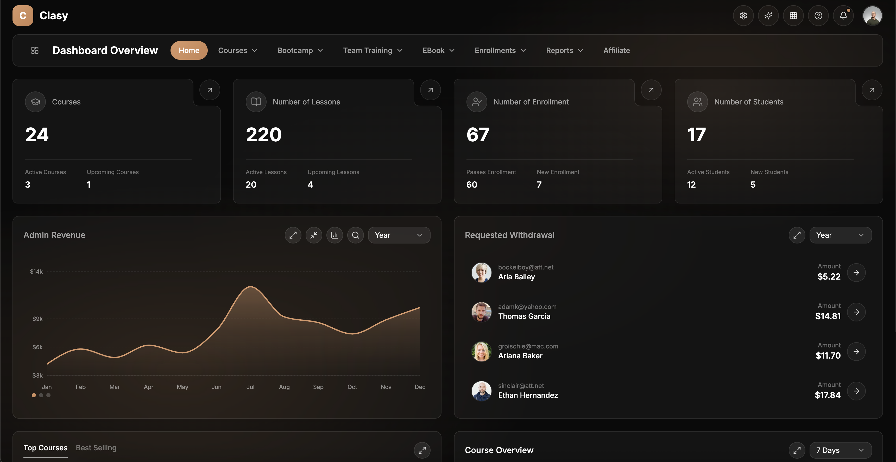
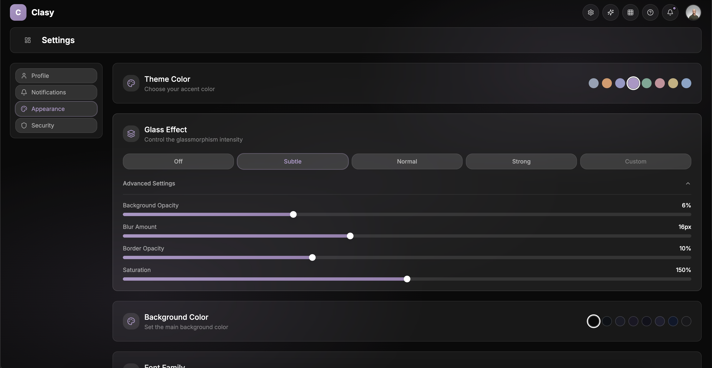

# Glassmorphism Admin Panel UI

Modern, full-featured admin dashboard with stunning glassmorphism design. Built with Next.js 15 and React 19. Features comprehensive management interface for courses, bootcamps, e-books, enrollments, and more.

## Screenshots

### Dashboard


### Settings - Theme Customization


## Tech Stack

| Category | Technologies |
|----------|-------------|
| **Framework** | Next.js 15.1.0, React 19.0.0, TypeScript 5.7.2 |
| **Styling** | Tailwind CSS 3.4.16, Glassmorphism Design |
| **UI Components** | shadcn/ui, Radix UI 2.x |
| **Animations** | Framer Motion 11.15.0 |
| **Charts** | Recharts 2.15.0 |
| **Icons** | Lucide React 0.468.0 |

## Features

### Dashboard
- Overview statistics (Courses, Lessons, Enrollments, Students)
- Revenue analytics with interactive charts
- Withdrawal requests management
- Top courses and best-selling courses
- Course performance overview

### Courses Management
- Full CRUD operations for courses
- Search and filter functionality
- Course details: name, category, students, price, rating, status
- Bulk actions and status/category filtering

### User Management
- Multi-role support (Admin, Instructor, Student)
- Search and filter by role
- User statistics and activity tracking

### Bootcamps
- Bootcamp listing and management
- Duration, participants, dates, pricing
- Status tracking

### Enrollments
- Student enrollment tracking
- Status filtering (active, pending, completed)
- Payment amount tracking

### Team Training
- Corporate training program management
- Company progress tracking
- Employee management

### E-Books
- E-book catalog management
- Sales and rating tracking
- Category organization

### Affiliate Program
- Affiliate partner management
- Referral and earnings tracking

### Reports & Analytics
- Monthly revenue reports
- User activity tracking
- Revenue trends visualization
- Export functionality

## Advanced Theme System

### Color Palettes
8 built-in theme colors:
- Slate, Peach (Orange), Lavender (Indigo), Lilac (Purple)
- Sage (Emerald), Blush (Rose), Sand (Amber), Sky (Blue)

### Glass Effect Customization
- 4 Presets: Off, Subtle, Normal, Strong
- Custom mode with controls:
  - Background opacity (0-20%)
  - Blur amount (0-40px)
  - Border opacity (0-30%)
  - Saturation (100-200%)

### Font Support
5 Google Fonts:
- Inter, Poppins, Roboto, Montserrat, Space Grotesk

### Persistence
All theme settings saved to localStorage.

## Project Structure

```
src/
├── app/                    # Next.js App Router Pages
│   ├── page.tsx           # Dashboard
│   ├── courses/           # Courses management
│   ├── users/             # User management
│   ├── settings/          # Settings & customization
│   ├── bootcamp/          # Bootcamp management
│   ├── enrollments/       # Student enrollments
│   ├── team-training/     # Team training programs
│   ├── ebooks/            # E-books management
│   ├── affiliate/         # Affiliate program
│   └── reports/           # Analytics & reports
│
├── components/
│   ├── ui/                # shadcn/ui components
│   ├── layout/            # Sidebar, Header
│   ├── glass/             # Glassmorphism components
│   ├── charts/            # Chart components
│   └── shared/            # Shared components
│
├── contexts/
│   └── theme-context.tsx  # Theme system
│
└── lib/
    ├── mock-data.ts       # Sample data
    ├── navigation.ts      # Navigation config
    └── utils.ts           # Utilities
```

## Installation

```bash
# Clone the repository
git clone https://github.com/nesdesignco/Glassmorphism-Admin-Panel-UI.git
cd Glassmorphism-Admin-Panel-UI

# Install dependencies
npm install

# Run development server
npm run dev
```

Open [http://localhost:3000](http://localhost:3000) in your browser.

## Scripts

| Command | Description |
|---------|-------------|
| `npm run dev` | Start development server |
| `npm run build` | Build for production |
| `npm start` | Start production server |
| `npm run lint` | Run ESLint |

## Configuration

### Next.js Image Optimization
External image sources configured:
- images.unsplash.com
- randomuser.me
- i.pravatar.cc

### TypeScript
- Strict mode enabled
- Path alias: `@/*` → `./src/*`

### Tailwind CSS
- Dark mode support
- Custom color system with CSS variables
- Extended animations

## Component Library

### UI Components (shadcn/ui)
Button, Card, Avatar, Badge, Tabs, Select, Tooltip, Dropdown Menu, Separator, Label, Progress, Switch, Toast, Slider

### Glass Components
- `GlassCard` - Card with glassmorphism effect
- `GlassButton` - Button with glass styling
- `GlassInput` - Input field with glass effect
- `GlassModal` - Modal dialog with glass styling

### Chart Components
- `AreaChart` - Time-series visualization
- `BarChart` - Comparative visualization
- `DonutChart` - Proportion visualization
- `RadialBarChart` - Radial visualization

### Shared Components
- `DataTable` - Generic table with sorting/filtering
- `StatCard` - Statistics display card
- `StatsRow` - Row of multiple stat cards

## Backend Integration

Currently uses mock data. Ready for integration with:
- REST API
- GraphQL
- Database (PostgreSQL, MongoDB, etc.)

All components accept data props for easy backend connection.

## Browser Support

- Chrome (latest)
- Firefox (latest)
- Safari (latest)
- Edge (latest)

## License

MIT

---

Built with Next.js and React
